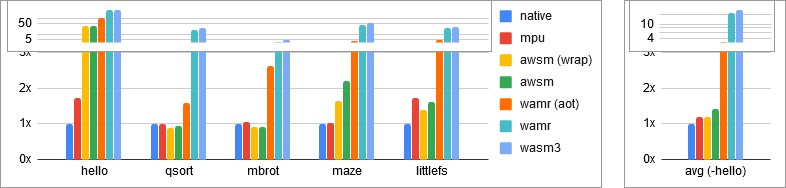
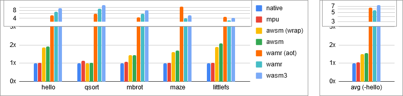

# The Bento-box meta-linker

This is the home of the bento-linker, a tool for generating glue for
bento-boxes.

Note! This project is very expiremental and only provided as is.

## What are bento-boxes?

Bento-boxes are independently-linked, memory-isolated pieces of code that are
designed to work together. You can think of them as a light-weight alternative
to processes for microcontrollers.

Unlike processes, Bento-boxes don't require mutlithreading or virtual memory.
Instead of files and pipes, boxes communicate using type-rich
inter-box-communication (IBC) mechanisms that behave like familiar C functions
with a few limitations.

A Bento-box is described by two things:
1. A set of memory regions + data
2. Function-like imports and exports

When provided by a config that describes these boxes, the bento-linker (this
tool) can generate a variety of different glue that enables some pretty
powerful features:

1. Automatic handling of box state bringing up/down boxes as needed. This
   enables RAM-sharing, compressed boxes, or even storing boxes on external
   storage.

2. Component-level firmware updates. With clearly defined memory regions and
   standard IBC mechanisms, it's easy to update a single part of the system.
   This reduces risk and bandwidth cost for rolling out bug-fixes or new
   features in the field.

3. Hardware or software enforced memory isolation. No more losing the entire
   device because your CBOR parser had a buffer overflow. If a rogue box
   tries to escape its allocated memory regions it is killed and an error
   is politely returned to the caller.

And some less powerful but nice features:

1. Programming language interoperability. The requirements for imports and
   exports are the same as the requirements for FFI and can be automatically
   generated.

2. A good target for LTO, balancing optimizations and build time.

If you noticed that these sound awfully similar to [WebAssembly][WebAssembly]
modules, you'd be right! On of our goals with this project is to take the ideas
present in WebAssembly and generalize them for other types of binaries and
runtimes.

Another important thing to note, these features are all optional. Bento-boxes
is a framework for generating glue based on these assumptions, but it's
completely valid to generate an "insecure" box without enforced memory
isolation. We've intentionally chosen rules that can be reduced to a simple
table of function pointers. We've intentionally made the rules flexible
to help with incremental adoption on systems with limited resources.

## The tool

At a high-level, the bento-linker takes in a description of bento-boxes,
and generates a set of outputs that can be used to build the final system.

Note that the bento-linker does not actually replace the build system's linker
or even the build system itself. Our goal is for it to be easy to add the
bento-linker to existing build systems without disruptive changes.

### Commands and ocnfiguration

Once installed, you should be able to run `bento` to see a list of commands.

Really the only important command is `bento build`. This takes in the box's
configuration and generates the requested outputs. At the time of writing,
all of the other commands are only informative, listing various metadata
about the evaluated bento-boxes. Feel free to play around.

So how do you actually describe the bento-box configuration?

The bento-box config is a rich set of key-value options. Each option can be
specified and overwritten on the command line, however you are more likely to
store a bento-box's configuration in a `recipe.toml` file.  The bento-linker
will automatically pick up `recipe.toml` files in each of the box's
directories, or you can specify the configuration of nested boxes with
additional box config section.

Storing a separate `recipe.toml` per box can be useful when boxes live in
different repos, however we've used a single `recipe.toml` per system here
and in the examples since it's easier to show.

You can find a full (and up to date!) list of every single configuration
option by running `bento options`.

### Recipes

Here's what a `recipe.toml` might look like:

``` toml
name = 'box1'
runtime = 'armv7m-mpu'
stack = 0x800
heap = 0x800

output.ld = 'bb.ld'
output.h = 'bb.h'
output.c = 'bb.c'
output.mk = 'Makefile'

memory.flash = 'r-xp 0x000fe000-0x000fffff'
memory.ram   = 'rw-- 0x2003e000-0x2003ffff'

export.box1_hello = 'fn() -> err'
export.box1_add2 = 'fn(i32, i32) -> i32'
import.sys_write = 'fn(const u8 buffer[size], usize size) -> errsize'
```

There's a lot to unpack here, so lets take a quick look at each section:

``` toml
name = 'box1'
runtime = 'armv7m-mpu'
stack = 0x800
heap = 0x800
```

Each box has a number of ungrouped configuration options that determine what
the bento-linker actually generates. This is where you can configure which
runtime or loader to use, as well as a number of parameters. You can run
`bento options` to see what is available.

``` toml
output.ld = 'bb.ld'
output.h = 'bb.h'
output.c = 'bb.c'
output.mk = 'Makefile'
```

Each box has a set of outputs. These are the actual files where the
bento-linker generates glue.

The full list of possible outputs can be listed with the `bento outputs`
command.

Note that every output is optional. They are intended to be consumed by the
developer's build system but each output can be omitted without side-effects.

``` toml
memory.flash = 'r-xp 0x000fe000-0x000fffff'
memory.ram   = 'rw-- 0x2003e000-0x2003ffff'
```

Each box has a set of memory regions. These are described by a set of mode
flags and address range. In additional to the traditional read (r), write (w),
and execute (x) flags, there is an additiona persist (p) flag used to indicate
if a memory is persistant across power-cycles.

Note, if you only provide a size (`r-xp 0x2000`), the bento-linker will
automatically allocate the appropriate memory from the containing box. However
this only works if the description of the containing box is present.

Also note, you can name the memory regions anything you like.

``` toml
export.box1_hello = 'fn() -> err'
export.box1_add2 = 'fn(i32, i32) -> i32'
import.sys_write = 'fn(const u8 buffer[size], usize size) -> errsize'
```

And last but not definitely not least, each box has a set of imports and
exports. These are described by a function-like type declaration.

There are a number of argument/return types that can be used:

- `i8/i16/i32/i64/isize` - Signed integers.

- `u8/u16/u32/u64/usize` - Unsigned integers.

- `f32/f64` - Floats.

- `err/err32/err64/errsize` - These are special signed integers that
  may contain a negative error code.

  If an import/export returns an err type, the bento-linker will generate
  glue code that returns a polite error if a box abort occurs.

- `mut <type>*/const <type>*` - A pointer to one of the previous types.

  As an additional restriction to traditional pointers, these pointers are not
  allowed to pointer to memory outside of the box. A runtime is free to abort
  if a box tries to pass an illegal pointer to another box.

  Note that one of mut/const is required.

- `nullable mut <type>*/nullable const <type>*` - A nullable pointer, like
  the above but can be NULL. This is explicitly required for imports/exports
  that may take NULL.

- `mut <type>[<size>]/const <type>[<size>]` - An array of a previous type.
  These are similar to pointers, but with an explicit size indicating how many
  elements are referenced.

  The size can be a constant number, or it can be the name of another variable
  in the argument list.

For more examples of `recipe.toml`s look at the [examples](#examples)! There
are a number of fully functional `recipe.toml` files in the
[examples](examples) directory.

### API

So once we've generated some glue, what does this give us?

The actual imports and exports are hopefully quite simple. Give the above
`recipe.toml`, the `bb.h` file will be generated with this function:

``` c
ssize_t sys_write(const void *buffer, size_t size);
```

Additionally, `bb.h` will include declarations of the exports for typechecking
purposes:

``` c
int box1_hello(void);
int32_t box1_add2(int32_t, int32_t);
```

Compile and link, and as long as you follow the rules you should be able to
call between boxes without extra work.

There are also a couple extra convenience functions for interacting with the
boxes.

From outside a box:

- ``` c
  int __box_<name>_init(void);
  ```

  Attempt to manually bring up a box. A negative error code is returned if
  the box fails to be brought up.

  By default, boxes are automatically brought up as needed, but this runtime
  check can be disabled by setting `lazy=false`.

- ``` c
  int __box_<name>_clobber(void);
  ```

  Release and mark a box as needing to be initialized again. This is
  automatically called if a conflicting box is brought up, but can also
  be manually called if there are some other shared resources.

- ``` c
  void *__box_<name>_push(size_t size);
  void __box_<name>_pop(size_t size);
  ```

  Allocate/deallocate memory on the box's stack. Since boxes can't access
  memory outside of their given memory regions, you often need to allocate
  memory in another box to pass around data.

  These functions let you allocate memory on a boxes stack for that purpose.

From inside a box:

- ``` c
  void __box_abort(int err);
  ```

  Manually abort the current box with the provided error code. Does not
  return.

- ``` c
  ssize_t __box_write(int32_t fd, const void *buffer, size_t size);
  ```

  Write to the stdout of a box. This is up to the containing box to handle
  and may do nothing. Useful for debugging.

- ``` c
  int __box_flush(int32_t fd);
  ```

  Flush the stdout of a box. This is up to the containing box to handle
  and may do nothing.`

By default, the bento-linker also tries to tie these into the language's
stdlib so that common functionality such as `printf`/`assert` should be behave
as expected.

## The glue

### Runtimes

The available runtimes can be listed with the `bento runtimes` command. These
determine how each box is executed.

- **jumptable** - A native runtime that uses a table of function pointers
  for connecting imports/exports.

  Note! No memory isolation is enforced with this runtime.

  By default, setjmp/longjmp is also used in the case of explicit aborts or
  assert failures, but this can also be disabled by setting
  `runtime.jumptable.no_longjmp=true`.

- **arm{v7m,v8m}-mpu** - A native runtime that uses an Arm MPU to enforce
  memory isolation.

- **arm{v7m,v8m}-sys** - This is a bit of a special runtime. It's a native
  runtime without memory isolation.

  However, instead of a jumptable, this runtime connects to the standard
  Arm ISR vector. This allows you to hook type-checked interrupt handlers
  as you would any other box export.

- **awsm** - aWsm is an Ahead-of-Time compiler for [WebAssembly][WebAssembly]
  that provides software enforced memory isolation at near-native performance
  as long as you can ensure the binary has not been tampered.

  More info here:  
  https://github.com/gwsystems/awsm

- **wamr** - Wamr is a [WebAssembly][WebAssembly] interpreter with an optional
  Ahead-of-Time compiler.

  More info here:  
  https://github.com/bytecodealliance/wasm-micro-runtime

- **wasm3** - Wasm3 is a [WebAssembly][WebAssembly] interpreter built on
  continuation passing, which allows for very few dependencies.

  More info here:  
  https://github.com/wasm3/wasm3

### Loaders

The available loaders can be listed with the `bento loaders` command. These
determine how each box is loaded before execution.

- **noop** - This is the default loader, which assumes the box can be placed
  in persistent executable memory.

- **glz** - This loader provides GLZ decompression at bringup time. GLZ is a
  compression algorithm designed for extremely lightweight decompression.

- **bd** - This loader loads boxes from a user provided block device.

- **fs** - This loader loads boxes from a user provided filesystem.

## The output

### Examples

You can find a number of examples in the [examples](examples) directory.

Most of these examples run on an [nrf52840][nrf52840], except the armv8m
examples, which use an [nrf5340][nrf5340].

If the [example dependencies](#example-dependencies) are available and
a gdb-server is running, you should be able to run each example with:

``` bash
bento build && make build flash reset
```

- **&lt;runtime&gt;-hello** - A simple hello world example that brings up
  two boxes that each print a hello world message.

  This example also tests a simple export, import, and an abort.

  This is the best example to start with when adding a new runtime.

  Why two boxes? Three boxes doesn't fit on this device with the current
  WebAssembly page size limitations (64KiB page vs 256KiB available RAM).
  Note this is something possible to fix in the WebAssembly spec.

- **&lt;runtime&gt;-qsort** - This examples performas quick-sort on an
  array on integers.

  It's a fairly simple example, but a good showcase of performance in
  tight loops with memory accesses.

  It also showcases using `__box_<name>_push/pop` to allocate memory
  inside the box.

  The largest input is 10K ints.

- **&lt;runtime&gt;-mandlebrot** - This example renders a 80x80 Mandlebrot
  set to the serial output as ascii art, shading each pixel based on the
  number of iterations until divergence, up until 100 iterations.

  It's a good showcase of floating-point operations in a tight loop.

- **&lt;runtime&gt;-maze** - This example generates and solves mazes.
  The maze generation steps and solution are rendered to the serial
  output as ascii art.

  The neat little cave-generation algorithm is taken from this
  blog post, you can find more info on it here:
  https://kairumagames.com/blog/cavetutorial

  ```
  ::::'''::::::::::::::::::::::::::::::::
  :'xx x   '''''''''''':''''''''''':'':::
  :  .x:xx     ...                     ::
  :..::'  xx .::::::..   .    .::.    .::
  :::'      xx''::::::::::::::::::.   :::
  :::  .::.   xx :::'''''''::::::::.   ::
  :::..::::     xx     xx    '''':::.   :
  :::::::::       xx xx::xx     .::::   :
  :::'''''      .::.x ::::.xx..::::::..::
  ::             :::..::::: x::::::::::::
  :               :::::::::  xx:::::'''::
  :     .::        :::::::   xx:''    .::
  :    .:::    :     '''      xx    .::::
  :   .::::.         ...       xx    ''':
  ::::::::::        .:::.    xx:::::..  :
  ::::::''     ::    ::::     x::::::::::
  :::'                 '::::.  xx''''':::
  :::.    .::.     ...   :::::.. xx  .:::
  ::::.   ::::...:::::.   ::::::.  xx::::
  '''''''''''''''''''''''''''''''''''''''
  ```

  Also, the maze generation/solver are written in Rust, and the kernel in C.

  Also also, the maze generation and maze solver are separate boxes that
  share RAM, with the maze generation getting clobbered when the system brings
  up the maze solving box.

  This example is a good showcase of several RAM-based data structures and
  very unpredictable branching patterns. It's literally solving a maze.

  The largest input is a 160x160 byte maze.

- **&lt;runtime&gt;-littlefs** - This example runs the [LittleFS][littlefs]
  filesystem inside its own box, using import/exports to communicate with
  a simulated block device.

  The example itself does a few things:
  1. Updates a boot count.
  2. Logs a value to a rotate-based log, renaming the log file
     every 1000 updates.

  To simulate rebooting, the box is clobbered every 10K updates. This happens
  10 times for a total of 100K updates.

  This example is a good showcase of a real-world import/export heavy use case
  with relatively complex logic. It's a good example of where adopting
  bento-boxes could be valuable for protected a system from
  difficult-to-bugproof code.

- **&lt;runtime&gt;-rsa** - This example uses [MbedTLS][mbedtls] to perform
  asymmetric encryption/decryption using RSA-pkcs1. There are three different
  boxes active here, one box containing the MbedTLS logic, and two other boxes
  acting as Alice and Bob sharing encrypted messages with each other.

  This is intended to showcase how a system may keep sensitive secrets in its
  own box, and instead reference these secrets with file-descriptor-esque ids.
  The ability to bind unique identifiers to imports helps quite a bit here.

  Unfortunately, due to WebAssembly page size issues, this example only works
  with the native runtimes.

- **1box** - A minimal example with one box.

- **3box** - A minimal example with three boxes loaded simultaneously.

- **nobox** - A minimal example with no box.

  Note this still uses the armv7m-sys runtime which provides some conveniences
  such as esr/isr linkages.

- **upsidedownbox** - A minimal example with the box in the root of the
  directory, and the kernel in a subdirectory.

  This is helpful for applications which contain an OS or bootloader as a
  dependency.

- **compression** - A minimal example with GLZ-compressed boxes.

  The boxes are stored in internal-flash and decompressed into RAM
  as needed.

- **bd** - A minimal example with boxes stored on external storage.

  The boxes are stored in an external block-device and loaded into RAM
  as needed.

- **bdcompression** - A minimal example with GLZ-compressed boxes stored on
  external storage

  The boxes are stored in an external block-device and decompressed/loaded
  into RAM as needed.

- **fs** - A minimal example with boxes stored on external storage.

  The boxes are stored in an external littlefs image and loaded into RAM
  as needed.

- **fscompression** - A minimal example with GLZ-compressed boxes stored on
  external storage

  The boxes are stored in an external littlefs image and decompressed/loaded
  into RAM as needed.

- **ramsharing** - A minimal example where multiple boxes share RAM.

  By marking boxes as `idempotent` and assigning overlapping RAM regions,
  bento-boxes automatically brings up/down boxes as needed. However,
  idempotent boxes do not preserve state when this happens.

- **c** - A simple example in C.

  Calculates Fibonacci numbers and quick-sort.

- **rust** - A simple example in Rust.

  Calculates Fibonacci numbers and quick-sort.

- **multilang** - A simple example combining both C and Rust.

  Calculates Fibonacci numbers and quick-sort. For an added flourish,
  quick-sort is performed while changing languages every partition step.

### Example dependencies

The examples have a number of dependencies, these can be found in the
[extras](extras) directory.

Note, some of the extra libraries take a while to compile (think LLVM). You may
consider instead downloading their recent releases here:

- wasi-sdk - https://github.com/WebAssembly/wasi-sdk/releases/tag/wasi-sdk-8

  In ./extra:
  ``` bash
  wget https://github.com/WebAssembly/wasi-sdk/releases/download/wasi-sdk-8/wasi-sdk-8.0-linux.tar.gz
  tar xvfz wasi-sdk-8.0-linux.tar.gz
  ln -s wasi-sdk-8.0 wasi-sdk
  ```

- wabt - https://github.com/WebAssembly/wabt/releases

  In ./extra:
  ``` bash
  wget https://github.com/WebAssembly/wabt/releases/download/1.0.19/wabt-1.0.19-ubuntu.tar.gz
  tar xvfz wabt-1.0.19-ubuntu.tar.gz
  ln -s wabt-1.0.19 wabt
  ```

### Testing

Currently there are only tests for configuration -> compilation. These can be
found in the [tests](tests) directory. You can run these with pytest:

Note that the example compilation tests require all of the
[example dependencies](#example-dependencies) to be available.

``` bash
pytest -v
```

### Results

Unfortunately, we don't have exhaustive benchmarks across all of the runtimes.
(If anyone does this, let us know).

But, to start the discussion and prove the validity of these approaches, I've
put together measurements of some the above examples:

Runtime (in ns):

|             | hello  | qsort   | mbrot   | maze      | littlefs  |
|-------------|-------:|--------:|--------:|----------:|----------:|
| native      |    271 |   84287 | 2186562 |   3118464 |   3850311 |
| mpu         |    463 |   84851 | 2275587 |   3203449 |   6654519 |
| awsm (wrap) |   9527 |   75256 | 1979281 |   5106498 |   5320550 |
| awsm        |   8508 |   78896 | 1988887 |   6823538 |   6150274 |
| wamr (aot)  |  28440 |  132688 | 5733677 |  12368716 |  17249899 |
| wamr        |  93229 | 1551582 | 6608421 | 121541011 | 103575732 |
| wasm3       | 101678 | 2079359 | 8844360 | 157946032 | 114494192 |



Code size (in bytes):

|             | hello | qsort | mbrot | maze   | littlefs |
|-------------|------:|------:|------:|-------:|---------:|
| native      |  7616 |  5228 |  8532 |  16052 |    22944 |
| mpu         |  7900 |  5896 |  9216 |  16340 |    23228 |
| awsm (wrap) | 14152 |  5268 | 12368 |  25672 |    43428 |
| awsm        | 14664 |  5280 | 12240 |  27208 |    47524 |
| wamr (aot)  | 39772 | 30828 | 36816 | 176156 |   102848 |
| wamr        | 53160 | 47567 | 50117 |  63582 |    77792 |
| wasm3       | 72000 | 66143 | 68725 |  82382 |    96512 |



RAM lower-bound (in bytes):

|             | hello | qsort | mbrot | maze  | littlefs |
|-------------|------:|------:|------:|------:|---------:|
| native      |   304 | 40772 |  6772 | 43940 |     1468 |
| mpu         |   540 | 40860 |  6908 | 44240 |     1496 |
| awsm (wrap) |   504 | 40692 |  7000 | 44652 |     3712 |
| awsm        |   500 | 40692 |  7000 | 44672 |     3664 |
| wamr (aot)  | 15348 | 44700 | 17796 | 43084 |    77988 |
| wamr        | 19028 | 43660 | 19564 | 48116 |    91668 |
| wasm3       | 18588 | 45968 | 19048 | 49188 |    94176 |


Some notes:

- The RAM is measured by counting all non-zero bytes and then zeroing memory.
  It requires two runs to get the correct value.

  It's important to note that this is a absolute minimum lower-bound, and
  does not capture the padding cost allocators or the WebAssembly page size.

- The runtime measurement includes box bringup, import/export overhead, and
  box runtime costs. It intentionally excludes serial logging, block device
  operations, and bring down costs.

- The code size is measured using `bento build && make size`.

- Some of the runtimes have variations that require an additional flag during
  bento-linking:

  ``` bash
  bento build --all.runtime.awsm.bounds_check=wrap
  bento build --all.runtime.wamr.aot=true
  ```

## Extending the bento-linker

At its core, the bento-linker is a framework that matches bento-box
configuration to an extendable set of runtimes, loaders, and outputs.

Each piece of this framework is described by a Python class in their
respective directories:
- runtimes - [bento/runtimes](bento/runtimes)
- loaders - [bento/loaders](bento/loaders)
- outputs - [bento/outputs](bento/outputs)

The best place to get started would be to look at the existing classes and
start from the there.

Additionally, there are a set of glue classes in [bento/glue](bento/glue),
which provide some of the generic glue code that is common across all
runtimes.


[WebAssembly]: https://webassembly.org/
[nrf52840]: https://www.nordicsemi.com/Software-and-Tools/Development-Kits/nRF52840-DK
[nrf5340]: https://www.nordicsemi.com/Software-and-tools/Development-Kits/nRF5340-PDK
[littlefs]: https://github.com/ARMmbed/littlefs
[mbedtls]: https://github.com/ARMmbed/mbedtls
